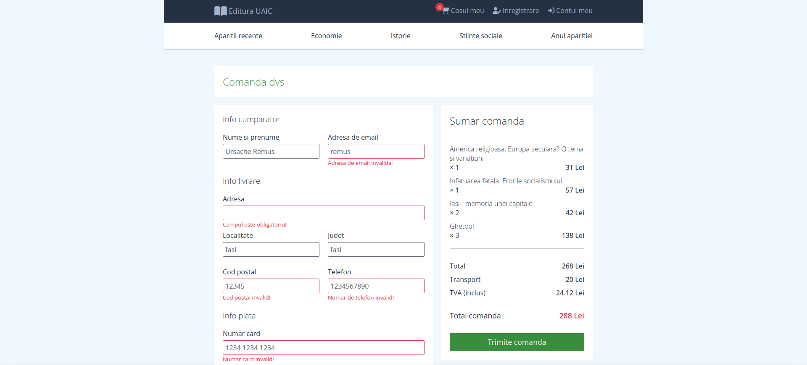

# Editura UAIC - Online Book Store
> Graduation project for the Wantsome Frontend programming course.

## Table of Contents
* [Structure and Features](#structure-and-features)
* [Technologies Used](#technologies-used)
* [Screenshots](#screenshots)
* [Setup and Usage](#setup-and-usage)
* [Contact](#contact)

## Structure and Features
- Home page (user nav, site nav, hero + search box, carousel, new books list).
- Products page (books grid, filter books by category, sort books by price).
- Product page (book: cover, info, tags, price, purchased quantity, add to cart button).
- Checkout page (purchased products list: titles, quantities, prices, total price; buyer info; payment info).
- Sign up + Sign in pages.
- All form fields have client side validation.
- Checkout, Sign up and Sign in use browser local storage to retain data during the session.
- Books database is stored in a local json file.

## Technologies Used
- HTML5.
- CSS3.
- JavaScript (Fetch API + async/await, high order functions, arrow functions, template literals, rest parameter, spread operator, destructuring).
- JSON. 

## Screenshots
### Home page

### Products page

### Product page

### Checkout page

### Sign up page

## Setup and Usage
- Clone or download repo.
- Use with Apache web server or Visual Studio Code + Live Server extension (or similar). 

## Contact
Created by [Remus Ursache / remus.ursache@dcsoft.ro] - Feel free to contact me!